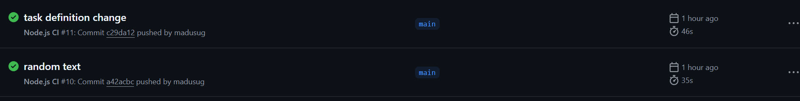

# GITHUB ACTIONS

This project focuses on the built in CI/CD platform for github, GITHUB Actions.

First, we were asked to create a simple server using express.js to serve a static page. I created a directory `mkdir my-express-server` and cd'd into it. I ran `npm init -y` but it didn't work. So I installed Node.js first using 
```
# Download and install fnm:
curl -o- https://fnm.vercel.app/install | bash

# Download and install Node.js:
fnm install 22

# Verify the Node.js version:
node -v # Should print "v22.14.0".

# Verify npm version:
npm -v # Should print "10.9.2".
```

This successfully installed npm and node. I then proceeded to install express using `npm install express`. Next, I set up my project structure as follows:
```
my-express-server
├── public
│   └── index.html
└── server.js
```
I then edited the contents of the static web page, "index.html", as follows:
```
<!DOCTYPE html>
<html>
<head>
  <title>Simple Express.js Server</title>
</head>
<body>
  <h1>Hello, this is a static web page served by Express!</h1>
</body>
</html>
```

Next, I edited the contents of the server.js file as follows:
```
const express = require('express');
const app = express();
const port = 3000;

// Serve static files from the "public" directory
app.use(express.static('public'));

// Start the server
app.listen(port, () => {
  console.log(`Server is running at http://localhost:${port}`);
});

```

Next, in GitHub, I went to Actions -> New Workflow and searched for a workflow to do a clean installation of node dependencies, cache/restore them, build the source code and run tests across different versions of node. After configuring the workflow I found, github created a node.js.yml file for me in the .github/workflows directory. The file had the following content.
```
name: Node.js CI

on:
  push:
    branches: [ "main" ]
  pull_request:
    branches: [ "main" ]

jobs:
  build:

    runs-on: ubuntu-latest

    strategy:
      matrix:
        node-version: [18.x, 20.x, 22.x]
        # See supported Node.js release schedule at https://nodejs.org/en/about/releases/

    steps:
    - uses: actions/checkout@v4
    - name: Use Node.js ${{ matrix.node-version }}
      uses: actions/setup-node@v4
      with:
        node-version: ${{ matrix.node-version }}
        cache: 'npm'
    - run: npm ci
    - run: npm run build --if-present
    - run: npm test
```
After successfully running the workflow, I decided to go even further I decided to edit my workflow to build images, run linter and send them to the docker repository.
```
name: Node.js CI

on:
  push:
    branches: [ "main" ]
  pull_request:
    branches: [ "main" ]

jobs:
  build:
    runs-on: ubuntu-latest

    strategy:
      matrix:
        node-version: [18.x, 20.x, 22.x]
        # See supported Node.js release schedule at https://nodejs.org/en/about/releases/

    steps:
    - uses: actions/checkout@v4
    - name: Use Node.js ${{ matrix.node-version }}
      uses: actions/setup-node@v4
      with:
        node-version: ${{ matrix.node-version }}
        cache: 'npm'
    - run: npm ci
    - name: Run Linter
      run: npx eslint .
    - run: npm run build --if-present
    - run: npm test
    -
      name: Login to Docker Hub
      uses: docker/login-action@v3
      with:
        username: ${{ secrets.DOCKERHUB_USERNAME }}
        password: ${{ secrets.DOCKERHUB_TOKEN }}
    -
      name: Set up QEMU
      uses: docker/setup-qemu-action@v3
    -
      name: Set up Docker Buildx
      uses: docker/setup-buildx-action@v3
    -
      name: Build and push
      uses: docker/build-push-action@v6
      with:
        context: .
        push: true
        tags: distinctugo/darey-github-actions:latest

    
```
For this to work, I discovered that I had to store my docker username and password as secrets on github. Thus allowing the values to be passed when running the workflow. This led to success.



## Code Analysis Tool

I added code analysis tool `Linter` using `npx eslint .` to my github actions workflow. I then configured linters and static code analyzers by creating the file `.eslintrc` and adding syntax to configure the rules for ESLint and specifying what should be checked: 

```
{
   "extends": "eslint:recommended",
   "rules": {
     // additional, custom rules here
   }
}
```
However, this didn't work. I kept on getting errors saying that the .eslintrc file was no longer valid. I did some research using various online tools and then proceeded to create the following file `eslint.config.js` and inputted the following syntax:

```
module.exports = {
    languageOptions: {
        globals: {
            document: 'true',
            window: 'true',
            console: 'true',
        },
    },
    rules: {
        semi: ['error', 'always'],
        quotes: ['error', 'single']
    }
};
```

This worked and I was able to run the workflow successfully.